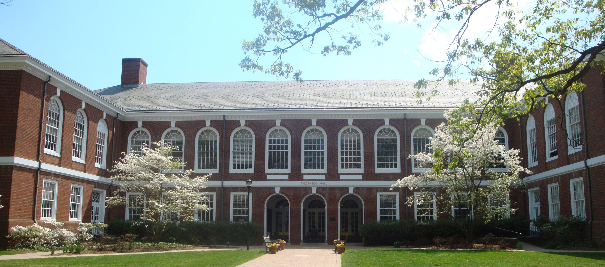
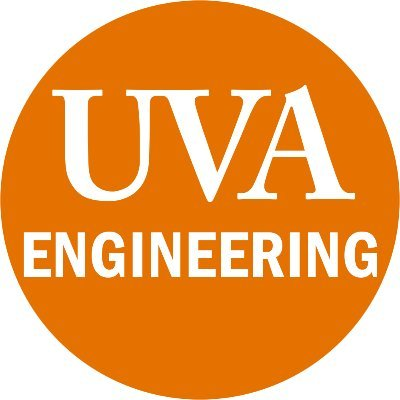
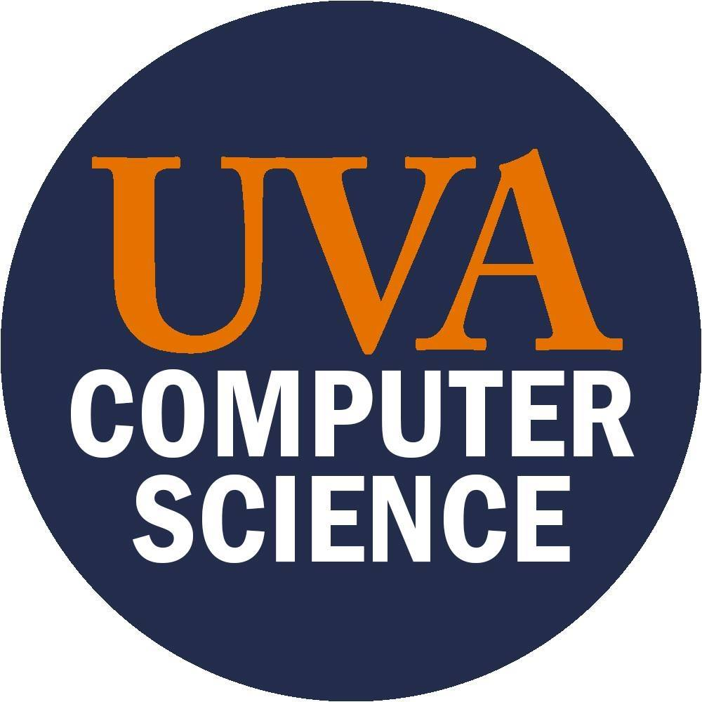

<!--- # llm-workshop-2024 ---> 

  

## 10/20/24: we had a great workshop - thanks everyone! 

## How to Participate

The workshop registration is open to anyone who is interested in LLM research and applications. Please register by **October 13**.

[Registration Link](https://forms.gle/YDu7xEGx8cCDYNp39)

~~There are different ways to participate in this workshop, please check out the [Call for Participation](calls.md) if you are interested!~~ (The submission portal is closed.)

## [Schedule](./schedule.md)

## [Keynotes](./keynotes.md)

## [Lightning talks and posters](./instructions.md)

## Goals

Large language models (LLMs) are advanced AI systems that excel in comprehending and generating human language. They utilize deep learning techniques to achieve unprecedented scale and complexity in language processing. One prominent example of LLM is ChatGPT, and they find application in intelligent educational tools, offering personalized tutoring and answering questions across various subjects. Moreover, LLMs have potential applications in scientific research by summarizing scientific discovery, extracting key information, and even deriving research plans. These capabilities can be extended to assist engineering researchers and educators in their domains.

## Dates and Location

- Dates: Oct. 19 -- Oct. 20
- Location: Thornton Hall A

## Organizers

- Yangfeng Ji (CS, co-chair)
- Felix X. Lin (CS, co-chair)
- Prasanna Balachandran (MSE/MAE)
- Meiqin Li (APMA)
- Sara Riggs (SIE)

**Contact the organizers**

Email to uva-llm-ws2024@virginia.edu

## Student committee members

**Co-chairs of lightning talks**

- Afsara Benazir
- Elizabeth Palmieri

**Co-chairs of poster sessions**

- Rongxiang Wang
- Dane Williamson

**Local organizing chairs**

- Caroline Gihlstorf
- Karolina Naranjo-Velasco
- Yixuan Ren
- Aidan San

**Local organizing chairs**

- Karolina Naranjo-Velasco
- Yixuan Ren
- Caroline Gihlstorf
- Aidan San
  
## Acknowledgment

This workshop is supported by the UVA Engineering Research Interest Group (RIG) program.
The workshop logistics are made possible via the support of the CS department.

  
  

<!-- ## Resources for LLMs -->

<!-- TODO -->

