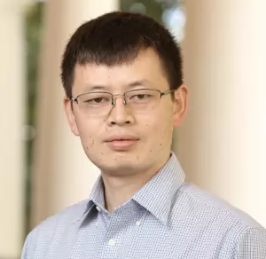

<!--- # llm-workshop-2024 ---> 

  

## How to Participate

The workshop registration is open to anyone who is interested in LLM research and applications. Please register by **October 13**.

[Registration Link](https://forms.gle/YDu7xEGx8cCDYNp39)

~~There are different ways to participate in this workshop, please check out the [Call for Participation](calls.md) if you are interested!~~ (The submission portal is closed.)

## Goals

Large language models (LLMs) are advanced AI systems that excel in comprehending and generating human language. They utilize deep learning techniques to achieve unprecedented scale and complexity in language processing. One prominent example of LLM is ChatGPT, and they find application in intelligent educational tools, offering personalized tutoring and answering questions across various subjects. Moreover, LLMs have potential applications in scientific research by summarizing scientific discovery, extracting key information, and even deriving research plans. These capabilities can be extended to assist engineering researchers and educators in their domains.

## Dates and Location

- Dates: Oct. 19 -- Oct. 20
- Location: Thornton Hall A

## Tentative Agenda 

**Coming Soon!**

## Organizers

- Yangfeng Ji (CS)
- Felix X. Lin (CS)
- Prasanna Balachandran (MSE/MAE)
- Meiqin Li (APMA)
- Sara Riggs (SIE)

|                                                                               |   |   |
|:------------------------------------------------------------------------------|:--|---|
|  |   |   |
| Yangfeng Ji                                                                   |   |   |

<article class="mw8 center">

<h1 class="f3 mb2"><a class="dark-gray link dim" href="https://yangfengji.net/" target="_blank">Yangfeng Ji</a></h1>
<h2 class="f5 fw4 gray mt0">University of Virginia</h2>

<h1 class="f3 mb2"><a class="dark-gray link dim" href="https://yangfengji.net/" target="_blank">Yangfeng Ji</a></h1>
<h2 class="f5 fw4 gray mt0">University of Virginia</h2>

</article>

## Committee Members

TBA

## Acknowledgment

This workshop is supported by the UVA Engineering Research Interest Group (RIG) program.

  

<!-- ## Resources for LLMs -->

<!-- TODO -->

