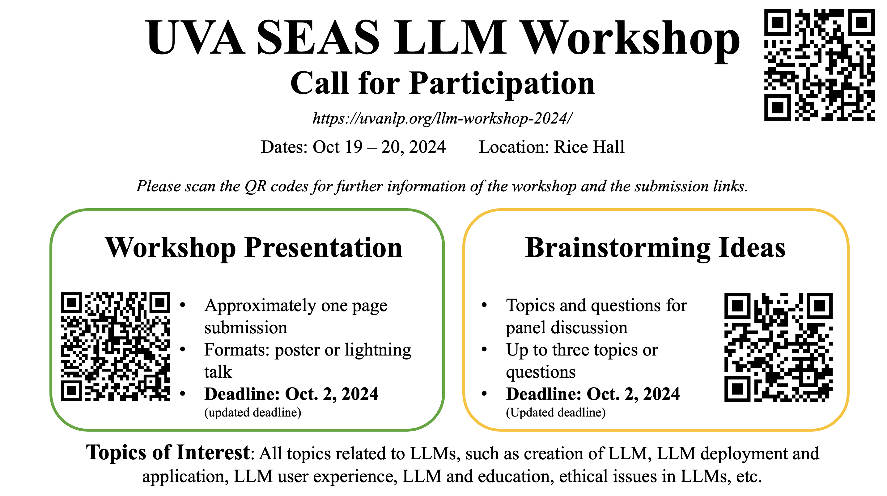

<!--- # llm-workshop-2024 ---> 

  

<a href="https://forms.gle/YDu7xEGx8cCDYNp39">RSVP</a>

Large language models (LLMs) are advanced AI systems that excel in comprehending and generating human language. They utilize deep learning techniques to achieve unprecedented scale and complexity in language processing. One prominent example of LLM is ChatGPT, and they find application in intelligent educational tools, offering personalized tutoring and answering questions across various subjects. Moreover, LLMs have potential applications in scientific research by summarizing scientific discovery, extracting key information, and even deriving research plans. These capabilities can be extended to assist engineering researchers and educators in their domains.

This workshop is supported by the UVA Engineering Research Interest Group (RIG) program.

## How to Participate

There are different ways to participate in this workshop, please check out the [Call for Participation](calls.md) if you are interested!

## Dates and Location

- Dates: Oct. 19 -- Oct. 20
- Location: Rice Hall

## Tentative Agenda 

This is a two-day workshop, with the following tentative events

- Day 1: Ideation
  - Invited talk
  - Panel discussion on LLM research
  - Research lightning talks
  - Poster sessions
- Day 2: Hands-on experience
  - Invited talk
  - Panel discussion on LLM applications
  - Roundtable discussion with underrepresented groups
  - Demonstrations of LLM in science and engineering applications

## Organizers

- Yangfeng Ji (CS)
- Felix X. Lin (CS)
- Prasanna Balachandran (MSE/MAE)
- Meiqin Li (APMA)
- Sara Riggs (SIE)

## Committee Members

TBA

## Acknowledgment

  

<!-- ## Resources for LLMs -->

<!-- TODO -->

